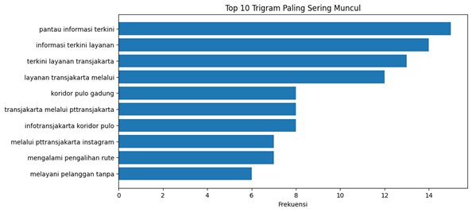
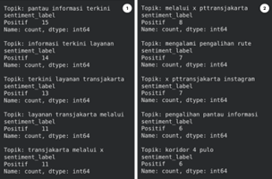

## Analisis Sentimen Transjakarta pada Media Sosial X Menggunakan Pendekatan Trigram dan Leksikon KSI (Kamus InSet)

### Link Google Colab

___
### 1. Pendahuluan
Layanan transportasi publik seperti Transjakarta sering menjadi subjek perbincangan dinamis di media sosial, khususnya X (sebelumnya Twitter). Opini publik yang tersebar dalam platform tersebut dapat menjadi sumber data tekstual untuk mengevaluasi persepsi masyarakat terhadap operasional layanan. Analisis sentimen berbasis Natural Language Processing (NLP) diperlukan untuk memetakan sentimen secara komputasional. Laporan ini berfokus pada ekstraksi fitur n-gram, secara spesifik trigram (n=3), dikombinasikan dengan pelabelan berbasis kamus (Indonesia Sentiment Lexicon/KamusInSet) untuk mengidentifikasi 10 topik perbincangan teratas terkait Transjakarta beserta polaritas sentimennya.

### 2. Metologi
- **Pengumpulan Data:**
Data diambil dengan menggunakan teknik crawling pada media sosial X dengan kata kunci "transjakarta", "tj", menghasilkan sekumpulan teks awal berjumlah 500 tweet.
- **Pra-pemrosesan Teks (Text Preprocessing):**
Tahap awal pembersihan data dilakukan secara manual untuk mengeliminasi tweet yang tidak relevan dengan konteks layanan "Transjakarta", sehingga diperoleh dataset sebanyak 131 tweet. Selanjutnya, data tersebut diproses secara otomatis menggunakan skrip pemrograman untuk membersihkan noise tekstual, yang mencakup penghapusan URL, mention (@), hashtag (#), dan karakter non-alfanumerik. Langkah krusial terakhir dalam tahap ini adalah penghapusan data ganda (drop duplicates) guna mengeliminasi cuitan identik seperti spam atau retweet masif. Rangkaian pra-pemrosesan ini dilakukan untuk memastikan model analisis tidak mengalami bias frekuensi dan hasil sentimen merepresentasikan opini yang unik.
- **Ekstraksi Fitur dan Pelabelan:**
Model mengekstraksi kelompok tiga kata berurutan (trigram) untuk menangkap konteks pembicaraan yang lebih spesifik. Pelabelan sentimen (positif, negatif) dihitung secara agregat menggunakan kamus leksikon InSet.

### 3. Hasil dan Pembahasan
- **Identifikasi 10 Topik Teratas (Trigram)**
Berdasarkan hasil ekstraksi CountVectorizer dengan parameter ngram_range=(3,3), ditemukan 10 kombinasi trigram dengan frekuensi kemunculan tertinggi.

Jika diamati secara makna, sebagian besar trigram teratas berfokus pada ranah pencarian informasi layanan seperti keterlambatan, perubahan rute, pembaruan rute dan sebagainya. Keluhan operasional seperti kerusakan fasilitas pada halte Transjakarta.
- **Distribusi Sentimen**

Hasil pelabelan menggunakan kamus InSet menunjukkan dominasi sentimen positif pada topik-topik teratas. Dominasi ini secara logis berkorelasi dengan sifat parameter trigram itu sendiri. Ekstraksi tiga kata spesifik (seperti "pantau informasi terkini") secara otomatis mengerucutkan sampel pada kelompok tweet dengan struktur kalimat formal atau informatif, di mana perbendaharaan kata pendampingnya cenderung memiliki bobot nilai netral hingga positif dalam kamus InSet.

### 4. Kesimpulan
Analisis trigram pada dataset Transjakarta mengindikasikan bahwa perbincangan pengguna X terpusat pada isu informasi layanan Transjakarta. Validasi data pasca-pembersihan membuktikan bahwa perbincangan publik lebih banyak bersifat informatif, yang terefleksikan dalam kecenderungan sentimen yang seragam.